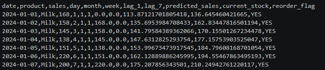
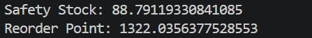

🛒 Retail Sales Forecasting & Inventory Optimization System
📌 Project Overview
This project predicts future retail sales and optimizes inventory using data-driven techniques.
🎯 Problem Statement
Retail businesses often face:
Overstocking (waste of money)
Stockouts (loss of sales)
This system solves both using forecasting and inventory logic.
💡 Solution
Forecast future demand using Machine Learning
Calculate safety stock and reorder point
Generate reorder alerts automatically
⚙️ Tech Stack
Python
Pandas, NumPy
Scikit-learn
Matplotlib
📊 Features
Sales Forecasting
Inventory Optimization
Reorder Alert System
Business Insights

📁 Project Structure
'''
Retail-Sales-Forecasting-Inventory-Optimization/
│
├── data/                      # Raw dataset
├── outputs/                   # Generated CSV outputs
│   ├── forecast.csv
│   ├── inventory_plan.csv
│
├── images/                    # Screenshots for README
│   ├── forecast_table.png
│   ├── forecast_graph.png
│   ├── inventory_table.png
│   ├── terminal_output.png
│
├── src/                       # Source code
│   ├── data_preprocessing.py
│   ├── forecasting.py
│   ├── inventory.py
│
├── main.py                    # Main execution file
├── requirements.txt           # Dependencies
├── README.md                  # Project documentation
└── .gitignore                 # Ignore files

'''
🚀 How to Run
python main.py

📸 Results
Forecast Table

Forecast Graph

 

Inventory Table

 

Terminal Output

 

📈 Business Impact
Reduces stockouts
Avoids overstocking
Improves profit planning

👩‍💻 Author
Nidhi Apotikar
